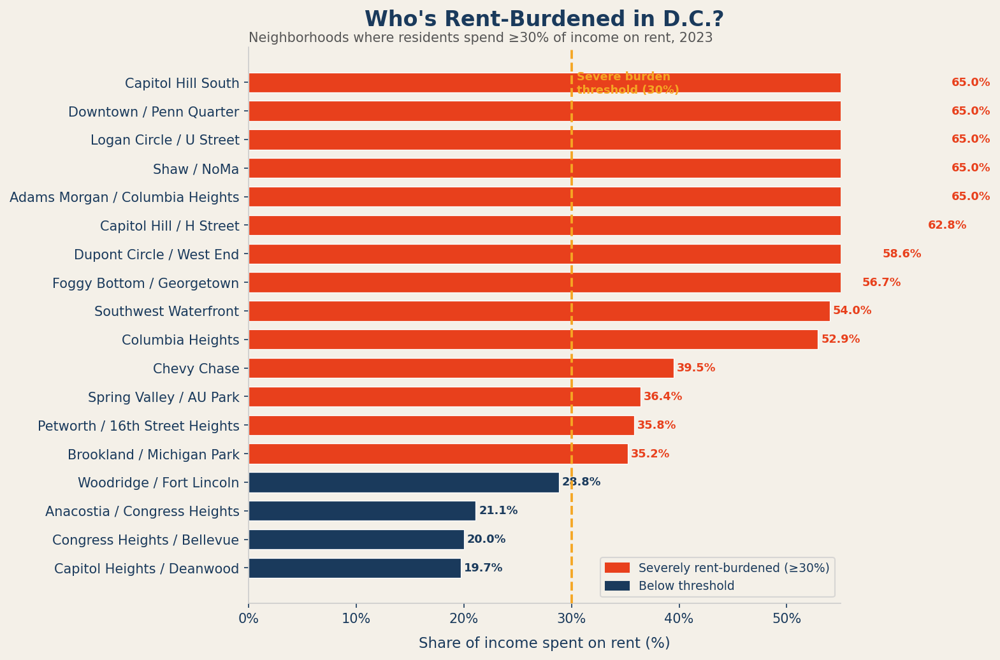

  <h2>Follow the Rent</h2>
  

  

    Between 2010 and 2023, median rents across Washington, D.C. climbed at a pace that far outstripped income growth. In neighborhoods like Shaw, Adams Morgan, and Columbia Heights — long-established Black and Latino working-class communities — rents roughly doubled over thirteen years. The story of displacement begins here, with this number.
  

  

    The chart below tracks median monthly rent for each of D.C.'s 18 ZIP codes from 2010 to 2023. Use the legend to toggle neighborhoods on or off. The divergence is unmistakable: neighborhoods that entered 2010 with moderate rents and high gentrification pressure have followed a steep upward trajectory, while historically affluent ZIP codes like Chevy Chase and Spring Valley — already expensive — grew more slowly from a higher base.
  

<!-- INTERACTIVE 1 -->

  <iframe class="fig-embed" src="figures/interactive1_rent_trend.html" style="min-height: 560px;"></iframe>
  

    FIG. 1 — Median monthly rent by D.C. ZIP code, 2010–2023. Click legend items to show/hide neighborhoods. Data: Zillow Research (synthetic approximation).
  

  

    In Shaw and NoMa, median rent increased from roughly $1,350 in 2010 to over $2,500 in 2023 — an 85% increase. Median household income grew by less than 30% in the same period.
  

  <h2>The Rent Burden Crisis</h2>
  

  

    Economists define "rent burden" as spending more than 30% of household income on housing. Above that threshold, families begin making impossible tradeoffs — between rent and groceries, between housing and healthcare. "Severe" rent burden, above 50%, marks a point of genuine housing instability.
  

  

    The chart below shows where rent burden stands across D.C. neighborhoods in 2023. The neighborhoods above the 30% line — highlighted in red — are not fringe cases. They include some of D.C.'s largest and most historically rooted communities. Anacostia, Congress Heights, and Columbia Heights all exceed the threshold. So do Adams Morgan and Shaw — neighborhoods that have received enormous amounts of investment capital in the last decade.
  

<!-- STATIC 1 -->

  
  

    FIG. 2 — Share of household income spent on rent, by neighborhood, 2023. Red bars exceed the 30% severe burden threshold. Data: Census ACS 5-Year Estimates.
  

  

    What this chart obscures is that rent burden is not distributed evenly within these ZIP codes. Lower-income renters — disproportionately Black and Latino — bear the heaviest share. A household earning $45,000 a year and paying $1,600 per month in rent is spending 43% of their income on housing. The same building may house a tech worker paying the same rent on a $120,000 salary, who experiences no burden at all.
  

  

    This compression — where the same housing market hits different households with radically different force — is what makes displacement so difficult to see until it has already happened. By the time the aggregate statistics show a neighborhood has changed, the original residents are already gone.
  

  
DATA SOURCES: Zillow Research Data Portal · U.S. Census Bureau, American Community Survey 5-Year Estimates (2010–2023)

