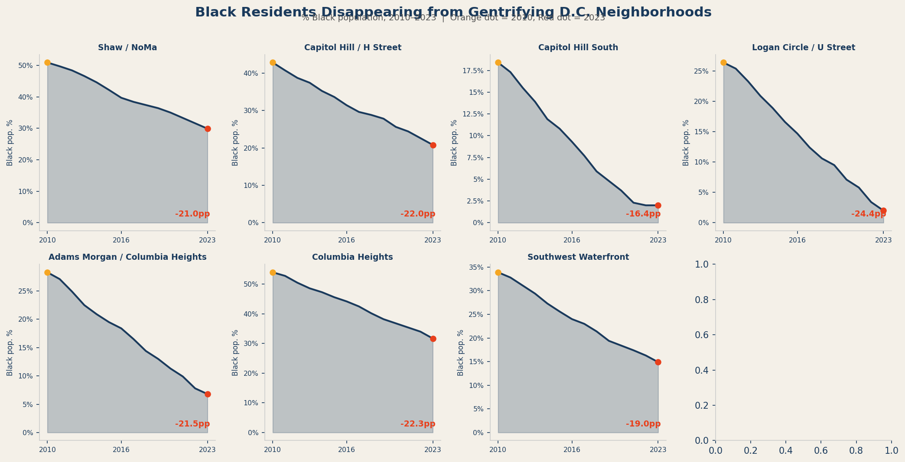

  <h2>Who Stays, Who Leaves</h2>
  

  

    Rent data describes pressure. Demographic data records the outcome. When rents rise faster than incomes can follow, displacement happens — and it doesn't happen equally. In Washington, D.C., the communities most displaced by gentrification have been Black residents who built these neighborhoods over generations, through redlining, disinvestment, and decades of policy neglect.
  

  

    The small multiples below show the share of Black residents in D.C.'s eight most rapidly gentrifying ZIP codes, from 2010 to 2023. The trend is consistent and directional: in every one of these neighborhoods, the Black population share declined — in some cases dramatically.
  

<!-- STATIC 2 -->

  
  

    FIG. 3 — Black population share (%) in D.C.'s eight highest-gentrification ZIP codes, 2010–2023. Orange dot = 2010 value. Red dot = 2023 value. Percentage point change labeled in red. Data: Census ACS.
  

  

    Shaw was 52% Black in 2010. By 2023, that figure had fallen by more than 18 percentage points. The neighborhood that gave rise to Duke Ellington now has more dog parks than barbershops.
  

  <h2>The Displacement Equation</h2>
  

  

    The scatter plot below maps each ZIP code along two axes: the percentage increase in median rent from 2010 to 2023 (horizontal), and the change in Black population share over the same period (vertical). The size of each bubble reflects the 2023 eviction rate. Color indicates the gentrification pressure score.
  

  

    The pattern is stark. ZIP codes with the largest rent increases cluster in the lower-right of the chart — meaning their Black populations declined the most. The neighborhoods with the smallest rent increases, predominantly already-affluent areas like Chevy Chase or Foggy Bottom, show the smallest demographic shifts. The direction of causation here is not perfectly established by correlation alone — but the pattern is consistent with displacement, not coincidence.
  

<!-- INTERACTIVE 2 -->

  <iframe class="fig-embed" src="figures/interactive2_scatter.html" style="min-height: 560px;"></iframe>
  

    FIG. 4 — Rent increase vs. change in Black population share, 2010–2023. Bubble size = 2023 eviction rate. Color = gentrification pressure score (blue = low, red = high). Hover for neighborhood detail. Data: Census ACS · Zillow.
  

  

    It is worth noting what demographic data cannot tell us: where people went. The Census does not track migration at the individual level. What we know from related research is that displacement in D.C. has pushed lower-income residents outward — to Prince George's County, to Charles County, to places farther from transit, farther from jobs, farther from the social networks they built in the city. The suburbanization of poverty is not a metaphor in the D.C. region. It is a measurable, documented trend.
  

  

    The people who left these neighborhoods did not leave because they wanted to. They left because staying became financially impossible.
  

  
DATA SOURCES: U.S. Census Bureau, ACS 5-Year Estimates · Zillow Research · Urban Institute, Metro D.C.

